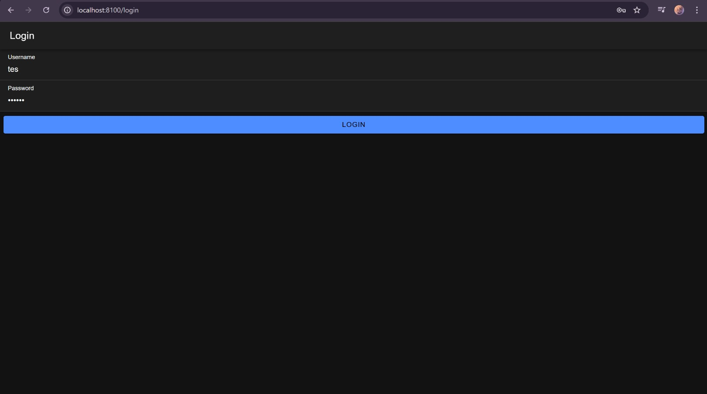
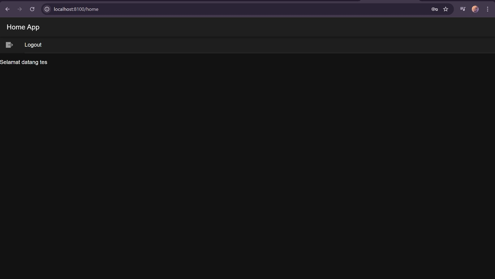

Nama : Dea Afni Azizah

NIM : H1D022093

Shift Baru: C

## PENJELASAN

Langkah 1 : Membangun Database dan API Backend
1. Database: Buat database bernama `coba-ionic` yang berisi tabel `user` dengan kolom `username` dan `password` yang telah di-hash dengan metode MD5.
2. File koneksi.php: Berfungsi menyediakan koneksi ke database MySQL.
3. File login.php: Bertugas menerima data `username` dan `password` yang dikirim melalui `php://input`, memeriksa data tersebut di database, serta mengembalikan status login (berhasil/gagal). Jika berhasil, akan mengirimkan token sebagai tanda autentikasi.

Langkah 2 : Frontend dengan Ionic dan Angular
Persiapan Proyek: 
Buat proyek dengan perintah `ionic start` dan instal modul-modul yang diperlukan.
Formulir Login
- Halaman login dibuat di `app/login/login.page.html` dengan input untuk `username` dan `password`.
- Di `login.page.ts`, terdapat fungsi `login()` yang mengirimkan permintaan ke API melalui `AuthenticationService`.
Authentication Service
- File `authentication.service.ts` menangani proses autentikasi, menyimpan token ke dalam Preferences, serta mengelola status login menggunakan `BehaviorSubject`.
- Metode `postMethod()` berfungsi untuk mengirimkan data ke API.
- Fungsi `saveData()` bertugas menyimpan token dan nama pengguna.
- Fungsi `logout()` menghapus data sesi dan mengubah status autentikasi menjadi `false`.
Proteksi Rute dengan Guards:
- Auth Guard (`auth.guard.ts`): Mencegah akses ke rute tertentu jika pengguna belum autentikasi.
- Auto-Login Guard (`auto-login.guard.ts`): Mengarahkan pengguna yang sudah login secara otomatis ke halaman home.
Rute Aplikasi:
- File `app-routing.module.ts` mengatur rute, di mana rute `home` dilindungi oleh `authGuard` dan rute `login` dilindungi oleh `autoLoginGuard`.

Halaman Home:
- Menampilkan nama pengguna dan menyediakan opsi untuk logout.

Alur Login:
1. Pengguna mengisi `username` dan `password` di formulir.
2. Fungsi `login()` mengirimkan data ke `login.php`.
3. Jika respons API menyatakan login berhasil, data disimpan dan pengguna diarahkan ke halaman `home`.
4. Jika login gagal, notifikasi kesalahan ditampilkan.

Screenshot tampilan:
1. Halaman Login
   
2. Halaman Home
   
